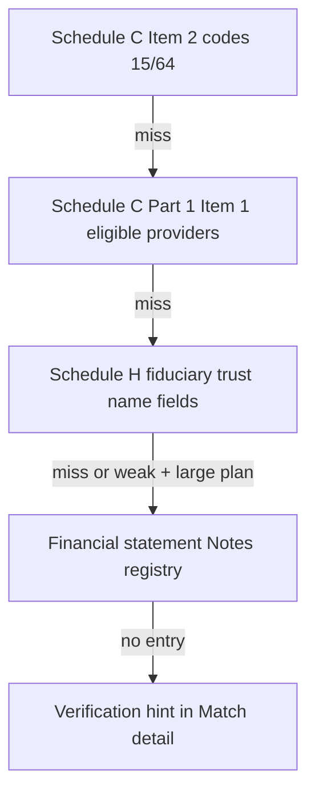

# Financial statement Notes fallback

For **large plans** (typically 5,000+ participants) that file **Schedule H**, the audited **Notes to Financial Statements** often name the recordkeeper in plain language — even when Schedule C Part 1 Item 2 has no service codes **15** or **64**.

DOL FOIA **CSV files do not include** that narrative text. This pipeline handles that gap.

## Fallback order (production matcher)



1. **Item 2** — standard recordkeeper / contract-admin service codes  
2. **Item 1** — eligible provider roster (e.g. `FID INV INSTL OPS CO`)  
3. **Schedule H** — `FDCRY_TRUST_NAME` / `FDCRY_TRUSTEE_CUST_NAME` when populated in CSV  
4. **Notes registry** — human-verified text from Schedule H attachment PDF  
5. **Hint** — large plan + weak DOL tier → prompt user to check Notes  

## Adding a company (e.g. after reading page 29 of the 5500)

Edit [`src/financial_notes.py`](../src/financial_notes.py) — add a key = normalized employer name (`NIKE`, `MICROSOFT`, …):

```python
"MICROSOFT": {
    "matched_employer_name": "MICROSOFT CORPORATION",
    "recordkeeper": "...",  # exact name from Notes
    "plan_name": "...",
    "plan_year": 2024,
    "plan_participants": 123456,
    "ein": "...",
    "notes_plan_year": "June 30, 2024",
    "quote_recordkeeper": "...",  # optional quoted phrase
    "quote_trustee": "...",       # optional — clarifies trustee vs RK
},
```

Run tests, then rebuild master cache if needed.

## Find candidates for research

```bash
python scripts/list_financial_notes_candidates.py --min-participants 5000 --limit 30
```

Lists large employers whose newest DOL row uses `TIER1_ITEM1` / `TIER1_SCH_H` / `TIER2` only — good targets to read Notes on the 5500 PDF.

## Example: Nike

Notes (plan year ended May 31, 2024) state:

- **Fidelity Workplace Services, LLC** — record keeper  
- **Northern Trust Company** — trustee  

Registry key: `NIKE` → used when service codes fail or Item 1 alone would be ambiguous.

---

[← Back to home](index.md)
