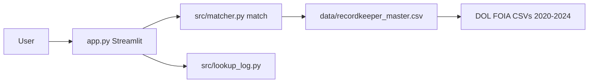

# 5500 Recordkeeper Lookup

Documentation for the **RecordKeeper Match Tool** MVP — how the code is organized, how DOL data flows in, and how to run tomorrow's demo.

**Run the app:** deploy via [Streamlit Community Cloud](https://share.streamlit.io) using `app.py` in the [GitHub repo](https://github.com/andresllamoza/RecordKeeper-Match-Tool).

---

## Pages

| Doc | Contents |
|-----|----------|
| [Demo script](demo.md) | Step-by-step demo employers and talking points |
| [Data pipeline](data.md) | DOL files, joins, cache, environment variables |
| [Code map](code.md) | Modules, key functions, tests |

---

## At a glance

- **~405k** plan/provider rows after join (multiple years, plan-level)
- **~86k** distinct normalized employers in the search index
- **25** automated tests (no live DOL download in CI)

---

## Quick links to source

- [app.py](https://github.com/andresllamoza/RecordKeeper-Match-Tool/blob/main/app.py) — UI
- [src/matcher.py](https://github.com/andresllamoza/RecordKeeper-Match-Tool/blob/main/src/matcher.py) — matching engine
- [tests/test_lookup_log.py](https://github.com/andresllamoza/RecordKeeper-Match-Tool/blob/main/tests/test_lookup_log.py) — tests
- [README](https://github.com/andresllamoza/RecordKeeper-Match-Tool/blob/main/README.md) — install and local run

---

*Internal PensionBee tool — password-gated on Streamlit Cloud.*
